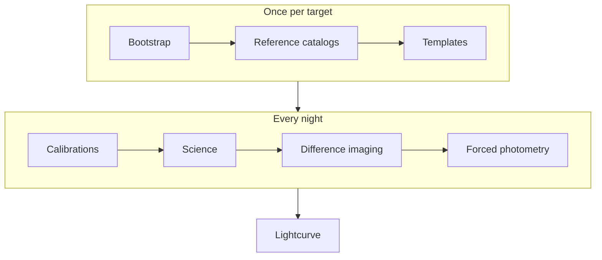

# How STIPS works

## The processing steps

`stips -c target.yaml run` carries one target through these steps. Most are
also CLI commands you can run on their own (see {doc}`reference/cli`).

| Step | Command | What happens |
|---|---|---|
| Bootstrap | `bootstrap` | Creates the Butler repository, registers the instrument and sky map, and ingests the MONSTER reference catalog. Runs once per repository. |
| Reference catalogs | `refcat fetch` | In `gaia_ps1` or `gaia` mode, fetches reference stars around the target from Gaia, and from Pan-STARRS in `gaia_ps1`. See {doc}`reference-catalogs`. |
| Templates | `ps1-template`, `external-template` | Fetches a reference image from a survey, or, within `run` only, builds a coadd of your own nights. See {doc}`templates`. |
| Calibrations | `calibs` | Ingests a night's raw frames and builds combined bias and flat frames. Curated calibrations, such as defect masks, come from the instrument. |
| Science | `science` | Instrument signature removal, then `calibrateImage`: PSF model, astrometric solution, photometric zero point, source catalog. |
| Difference imaging | `dia` | Warps the template to each science image, matches PSFs, subtracts, and detects sources in the difference. |
| Forced photometry | `fphot` | Measures flux at the target's fixed coordinates on difference images, direct images, or both. |
| Lightcurve | `lightcurve` | Collects the measurements from all nights into a CSV table and a plot. |

Variable-star and transit campaigns add a period or transit search at the end;
see {doc}`time-series`.

STIPS runs calibrations, science, difference imaging, and forced photometry
per night, and difference imaging and forced photometry per band, so a failure
in one night or band does not block the others.

## The pieces

**Configuration file**
: One YAML file per target. Its `env:` block says where the data repository,
  Rubin stack, instrument profile, and raw data are; the rest names the target,
  nights, bands, and template. See {doc}`configuration`.

**`stips` CLI**
: A Python package in its own virtual environment. It never imports the Rubin
  stack. For each step it starts a shell, activates the stack (`loadLSST`,
  `setup lsst_distrib`), and runs the Rubin `pipetask` and `butler` commands
  there.

**Rubin stack**
: Does the image processing. STIPS needs release `v30_0_3` of `lsst_distrib`;
  see {doc}`install-rubin-stack`.

**`obs_stips`**
: The bridge between STIPS and the stack. When the stack loads the instrument,
  `obs_stips` reads the active profile and builds the LSST instrument, header
  translator, and raw-file formatter from it. It also ships the default
  pipeline definitions and configs.

**Instrument profile**
: The directory named by `INSTRUMENT_DIR`, for example `instruments/nickel/`.
  It describes one telescope and can override any default pipeline or config
  file. See {doc}`forking-stips`.

**Butler repository**
: A directory (`REPO`) holding every raw frame, calibration, image, and
  catalog, organized into *collections*. See {doc}`outputs`.

## Observing nights and UT dates

Commands and collection names use the local observing night: the night that
starts on 19 May 2023 is `20230519`. The Butler indexes exposures by
`day_obs`, which for Nickel and CTIO is the next date, `20230520`. The
profile's `night_to_dayobs_offset_days` converts between them.

## Rubin terms

These come up in logs and error messages. The linked Rubin documentation has
the details.

| Term | Meaning |
|---|---|
| [Butler](https://pipelines.lsst.io/modules/lsst.daf.butler/index.html) | The data-access layer: a database plus files, queried by dataset type and data ID. |
| Collection | A named group of datasets. A *RUN* collection holds one processing run's outputs; a *CHAINED* collection searches several in order. |
| Dataset type | The kind of data, such as `raw`, `difference_image`, or `forced_phot_diffim_radec`. |
| [PipelineTask](https://pipelines.lsst.io/modules/lsst.pipe.base/index.html) | One processing step, such as `isr` or `calibrateImage`. A *pipeline* is a YAML file listing tasks. |
| Quantum graph | The plan `pipetask` builds before running: one node (*quantum*) per task per data ID. "Empty quantum graph" means the inputs were not found. |
| [`pipetask`](https://pipelines.lsst.io/modules/lsst.ctrl.mpexec/index.html) | The command that builds and runs quantum graphs. |
| EUPS, `setup` | The stack's package manager. `setup lsst_distrib` activates the stack in a shell. |
| [BPS](https://pipelines.lsst.io/modules/lsst.ctrl.bps/index.html) | The Batch Processing Service, which runs quantum graphs on a cluster. |
