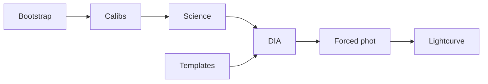

# STIPS

**The Small Telescope Image Processing Suite** brings the
[LSST Science Pipelines](https://pipelines.lsst.io/) to 1-meter class
telescopes.

STIPS wraps the Rubin/LSST reduction stack with the per-telescope plumbing a
small observatory needs — a declarative instrument profile, prefab YAML
pipelines, and a unified `stips` command-line interface — so you can run
survey-grade calibration, difference imaging, forced photometry, and lightcurve
extraction without deep LSST middleware knowledge. Its primary use case is
transient astronomy: supernova monitoring campaigns at the Nickel 1-m at Lick
Observatory.

[](https://github.com/dangause/stips/actions/workflows/ci.yml)
[](https://doi.org/10.5281/zenodo.23243456)
[](https://github.com/dangause/stips/blob/main/LICENSE)

<div class="grid cards" markdown>

-   :material-rocket-launch: **Getting started**

    ---

    Install STIPS, point it at an LSST stack, and run your first pipeline.

    [:octicons-arrow-right-24: Getting started](getting-started.md)

-   :material-star-shooting: **New campaign**

    ---

    Set up a new transient target: coordinates, nights, and template strategy.

    [:octicons-arrow-right-24: New campaign](new-campaign.md)

-   :material-telescope: **Add a telescope**

    ---

    Bring STIPS to your own 1-m with a declarative profile directory.

    [:octicons-arrow-right-24: Adding a telescope](forking-stips.md)

-   :material-console: **CLI reference**

    ---

    Every `stips` command and option, generated from the source.

    [:octicons-arrow-right-24: CLI reference](reference/cli.md)

</div>

## Supported instruments

| Instrument | Status | Notes |
|---|---|---|
| **Nickel 1-m**, Lick Observatory | Reference | Single CCD, B/V/R/I; Lick archive fetch. Used for active SN, exoplanet, and variable-star follow-up. |
| **CTIO 1.0m / Y4KCam** | Validated | 4-amp camera, on-chip binning (4064² and 2072²), B/V/R/I; NOIRLab Astro Data Archive fetch. |
| **Your 1-m** | Add one | Drop a declarative profile into `instruments/<name>/` — no per-instrument LSST `obs_` package. See [Adding a telescope](forking-stips.md). |

!!! info "Supported LSST stack"
    STIPS targets LSST Science Pipelines release **`v30_0_3`** — the version
    the Docker images build on and the docs are validated against. CI pins the
    weekly `w_2025_32`, and a scheduled canary tracks `w_latest`. Before
    upgrading, follow the [stack-bump runbook](stack-bump-runbook.md).

## What it does



- **Calibration** — nightly bias and flat construction, curated defect masks,
  crosstalk for multi-amp cameras.
- **Single-frame processing** — ISR, source detection, astrometric (Gaia DR3)
  and photometric (PS1 or Gaia) calibration, with automatic fallback configs.
- **Templates** — Pan-STARRS1 cutouts in the north; same-instrument coadds or
  SkyMapper cutouts in the south.
- **Difference imaging** — per night, per band, so a failure in one band does
  not block the others.
- **Forced photometry and lightcurves** — at the target's coordinates, on
  difference or direct images.
- **Scale-out** — one YAML drives the whole campaign locally, or on Slurm or
  HTCondor through BPS; Docker and Singularity images are provided.

## Quick start

```bash
# Install the framework (stips + obs_stips); instruments load by path
uv sync --group dev

# Run a full campaign from one self-contained YAML
stips -c scripts/config/2023ixf/pipeline_ps1_template.yaml run

# ...or step by step, with the same config
stips -c scripts/config/2023ixf/pipeline_ps1_template.yaml calibs 20230519
stips -c scripts/config/2023ixf/pipeline_ps1_template.yaml science 20230519
stips -c scripts/config/2023ixf/pipeline_ps1_template.yaml dia 20230519 --auto
```

The [configuration page](configuration.md) explains the YAML, and the
[getting started guide](getting-started.md) walks through a first run.

## Citing

If you use STIPS in your research, please cite it — see
[Citing STIPS](citing.md).
