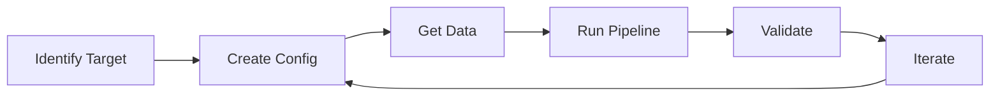

# Starting a New Observing Campaign

This guide walks you through setting up NPS for a new transient target (supernova, nova, or other variable source).

## Overview

Starting a new campaign involves:

1. **Gathering information** about your target
2. **Creating a configuration file** for your campaign
3. **Acquiring and organizing data**
4. **Running the pipeline**
5. **Validating results**



## Step 1: Gather Target Information

Before creating your configuration, collect:

### Required Information

| Field | Example | Where to Find |
|-------|---------|---------------|
| Object name | `2023ixf` | TNS, IAU Circulars |
| RA (degrees) | `210.910750` | TNS, Simbad |
| Dec (degrees) | `54.311694` | TNS, Simbad |
| Observation nights | `20230519, 20230521, ...` | Lick archive, observing logs |

### Template Strategy

Choose your template approach:

| Template Type | When to Use | Bands Available |
|---------------|-------------|-----------------|
| **PS1** | Quick start, no late-time Nickel data | r, i only |
| **Nickel Coadd** | Better PSF matching, have late-time data | B, V, R, I |

For PS1 templates, the SN must be faded or not present in PS1 imaging (pre-2014).

For Nickel coadd templates, you need observations after the transient has faded.

## Step 2: Create Your Campaign Directory

```bash
# Create campaign directory
mkdir -p scripts/config/my_target

# Copy an example config as starting point
cp scripts/config/2023ixf/pipeline_ps1_template.yaml \
   scripts/config/my_target/pipeline.yaml
```

## Step 3: Edit the Configuration File

Open `scripts/config/my_target/pipeline.yaml` and customize:

### Environment Section

```yaml
env:
  # Butler repository for this campaign (create new or use existing)
  REPO: "/path/to/data/my_target_repo"

  # LSST stack location
  STACK_DIR: "/path/to/lsst_stack"

  # NPS obs_nickel package
  OBS_NICKEL: "/path/to/nickel_processing_suite/packages/obs_nickel"

  # Parent directory containing YYYYMMDD/raw/ subdirectories
  RAW_PARENT_DIR: "/path/to/nickel/raw_data"

  # Reference catalogs repository
  REFCAT_REPO: "/path/to/refcats"
```

### Target Section

```yaml
# Object name (used for filtering FITS headers)
# Matching is case-insensitive and partial (e.g., "2023ixf" matches "SN2023ixf")
object: "my_target"

# J2000 coordinates in decimal degrees
ra: 123.456789
dec: 45.678901

# Bands to process (B, V for PS1 templates must use Nickel coadds)
bands: ["r", "i"]
```

### Template Section

For PS1 templates:

```yaml
template:
  type: ps1
  degrade_seeing: 2.0  # Convolve PS1 to ~2" to match Nickel seeing
```

For Nickel coadd templates:

```yaml
template:
  type: coadd
  # List nights when the transient had faded
  nights:
    - "20240601"
    - "20240615"
    - "20240701"
```

### Nights Section

Add all observation nights with their available bands:

```yaml
nights:
  # Night in YYYYMMDD format (local date at start of night)
  20230519:
    r: []  # Empty list = process all visits in this band
    i: []

  20230521:
    r: []
    i: []

  # Can specify individual visit IDs if needed
  20230525:
    r: [12345, 12346, 12347]  # Only these visits
    i: []
```

### Options Section

```yaml
options:
  jobs: 8                  # Parallel processing jobs
  skip_calibs: false       # Set true if calibs already built
  skip_science: false      # Set true if science already processed
  skip_dia: false          # Set true if DIA already done
  forced_phot: true        # Run forced photometry at coordinates
  continue_on_error: true  # Continue if one night fails
  use_fallbacks: true      # Try fallback configs on astrometry failure

# Lightcurve extraction and display
lightcurve:
  enabled: true
  dataset_type: forced_phot_diffim_radec
  min_snr: 1
  max_mag_err: 1.0              # Filter noisy points from plot (CSV keeps all)
  y_axis: apparent_mag          # apparent_mag, absolute_mag, flux_nJy, flux_adu
  x_axis: days_since_explosion  # mjd or days_since_explosion
  explosion_mjd: 60000.0        # Required for days_since_explosion
```

### Pipeline Configs (Optional)

Override default pipeline configurations:

```yaml
configs:
  science:
    calibrate_image: calibrateImage/tuned_configs/2023ixf_relaxed.py
    calibrate_image_fallbacks:
      - calibrateImage/tuned_configs/2023ixf_relaxed_psfex_sparse.py
  dia:
    subtract_images: dia/subtractImages.py
    detect_and_measure: dia/detectAndMeasure.py
```

## Step 4: Acquire Data

### From the Lick Archive

```bash
# Download each night
nickel download 20230519
nickel download 20230521
# ... etc
```

### Verify Data Structure

```bash
# Check that raw data exists
ls -la /path/to/raw_data/20230519/raw/

# Should see FITS files like:
# d0519_0001.fits  (bias)
# d0519_0050.fits  (flat)
# d0519_0100.fits  (science)
```

### Check for Required Frames

Each night should have:
- **Bias frames** (IMAGETYP = 'zero' or similar)
- **Flat frames** for each band you're processing
- **Science frames** of your target

## Step 5: Run the Pipeline

### Dry Run First

```bash
nickel run scripts/config/my_target/pipeline.yaml --dry-run
```

This shows what would be executed without running anything.

### Full Run

```bash
nickel run scripts/config/my_target/pipeline.yaml
```

### Monitor Progress

The pipeline outputs progress to stdout. For long runs, consider:

```bash
nickel run scripts/config/my_target/pipeline.yaml 2>&1 | tee pipeline.log
```

## Step 6: Check Results

### Processing Logs

Check for failures in `{REPO}/processing_log/`:

```bash
ls /path/to/my_target_repo/processing_log/
# 20230519_science_20240115T103045.json
# 20230521_science_20240115T104512.json
```

View a log:

```bash
cat /path/to/my_target_repo/processing_log/20230519_science_*.json | python -m json.tool
```

### Light Curve Files

```bash
ls /path/to/my_target_repo/lightcurves/
# my_target_r_lightcurve.csv
# my_target_r_lightcurve.png
# my_target_i_lightcurve.csv
# my_target_i_lightcurve.png
```

### Quick Validation

```python
import pandas as pd
import matplotlib.pyplot as plt

# Load light curve
lc = pd.read_csv("/path/to/repo/lightcurves/my_target_r_lightcurve.csv")

# Quick plot
plt.errorbar(lc['mjd'], lc['mag'], yerr=lc['mag_err'], fmt='o')
plt.gca().invert_yaxis()
plt.xlabel('MJD')
plt.ylabel('r magnitude')
plt.show()
```

## Step 7: Iterate and Refine

Common refinements:

### Add More Nights

Edit `nights:` section and re-run. Use `skip_calibs: true` and `skip_science: true` for nights already processed.

### Exclude Bad Exposures

If certain exposures have issues (tracking, clouds, etc.):

```yaml
nights:
  20230519:
    r: [12345, 12347]  # Explicitly list good visits, excluding 12346
```

### Try Different Template

If PS1 template has issues, switch to Nickel coadd:

```yaml
template:
  type: coadd
  nights:
    - "20231101"  # Late-time observations
```

### Adjust Pipeline Configs

For difficult fields (crowded, poor seeing), try relaxed configs:

```yaml
configs:
  science:
    calibrate_image: calibrateImage/tuned_configs/2023ixf_relaxed_psfex_sparse.py
```

## Example: Complete 2024abc Campaign Config

```yaml
# Pipeline configuration for hypothetical SN 2024abc
env:
  REPO: "/data/nickel/2024abc_repo"
  STACK_DIR: "/opt/lsst/stack"
  OBS_NICKEL: "/home/user/nickel_processing_suite/packages/obs_nickel"
  RAW_PARENT_DIR: "/data/nickel/raw"
  REFCAT_REPO: "/data/refcats"

object: "2024abc"
ra: 185.7289
dec: 12.3456
bands: ["r", "i"]

template:
  type: ps1
  degrade_seeing: 2.0

nights:
  20240115:
    r: []
    i: []
  20240118:
    r: []
    i: []
  20240122:
    r: []
    i: []
  20240130:
    r: []
    i: []

configs:
  science:
    calibrate_image: calibrateImage/tuned_configs/2023ixf_relaxed.py
    calibrate_image_fallbacks:
      - calibrateImage/tuned_configs/2023ixf_relaxed_psfex_sparse.py

options:
  jobs: 8
  forced_phot: true
  continue_on_error: true
  use_fallbacks: true

lightcurve:
  enabled: true
  dataset_type: forced_phot_diffim_radec
  min_snr: 1
  max_mag_err: 1.0
  y_axis: apparent_mag
  x_axis: days_since_explosion
  explosion_mjd: 60300.0       # Update to your target's explosion date
```

## Troubleshooting

### No science frames found for object

Check that the OBJECT header in your FITS files matches (partial, case-insensitive):

```bash
# Check FITS header
python -c "from astropy.io import fits; print(fits.getheader('frame.fits')['OBJECT'])"
```

### Science qgraph fails with "FileNotFoundError: astrometry_ref_cat"

This is caused by exposures with incorrect coordinates in their FITS headers (the Nickel telescope's DEC keyword sometimes gets stuck at a previous pointing's value). When using `nickel run`, the `ra`/`dec` from your YAML config automatically triggers pre-flight coordinate validation, which excludes bad exposures before building the qgraph.

If running `nickel science` standalone, pass `--ra` and `--dec`:

```bash
nickel science 20230519 --object 2023ixf --ra 210.91 --dec 54.32
```

### Astrometry failures

Try the relaxed PSF configs or exclude problematic frames.

### Template subtraction artifacts

- Check template and science image seeing match
- Try increasing `degrade_seeing` for PS1 templates
- Consider building Nickel coadd template instead

### Light curve has gaps

Some nights may have failed. Check processing logs and re-run failed nights individually.

## See Also

- [Configuration Reference](configuration.md) - All config options
- [CLI Reference](cli-reference.md) - Command details
- [Pipeline Flow](diagrams/pipeline-flow.mmd) - Visual pipeline overview
