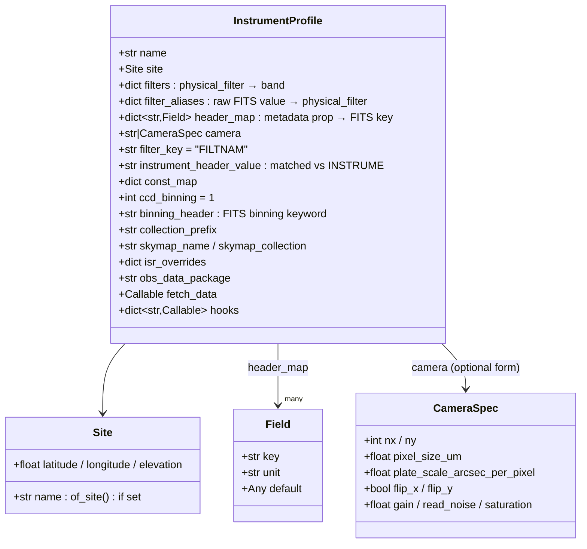
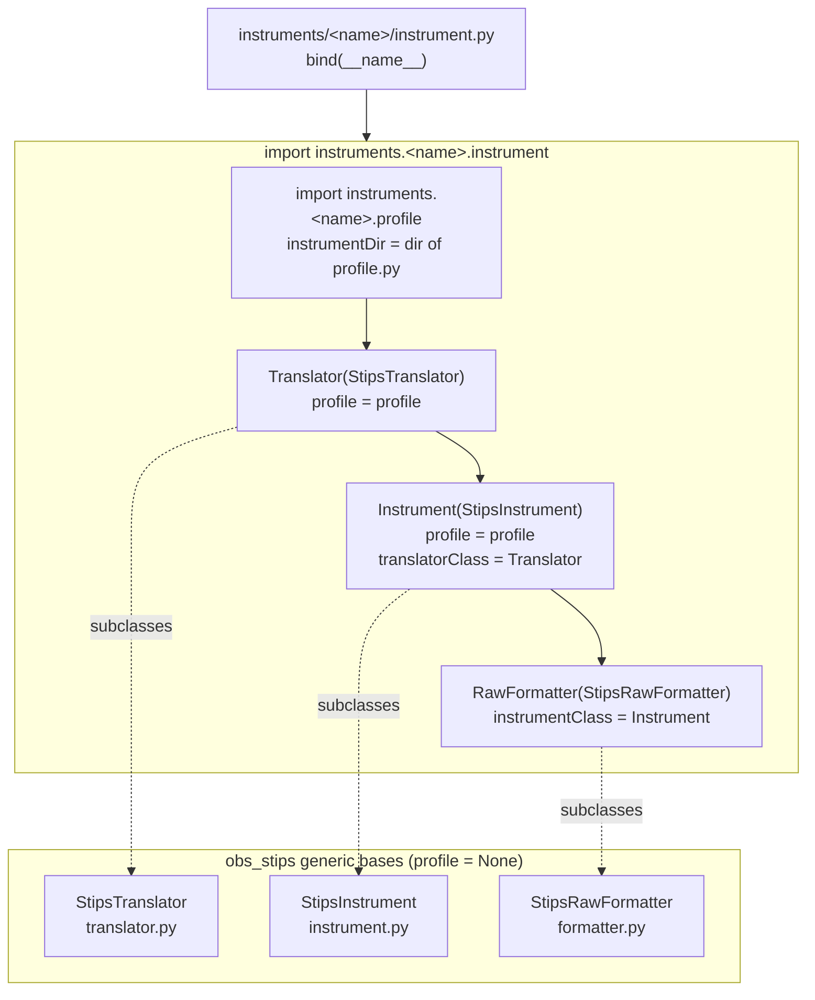
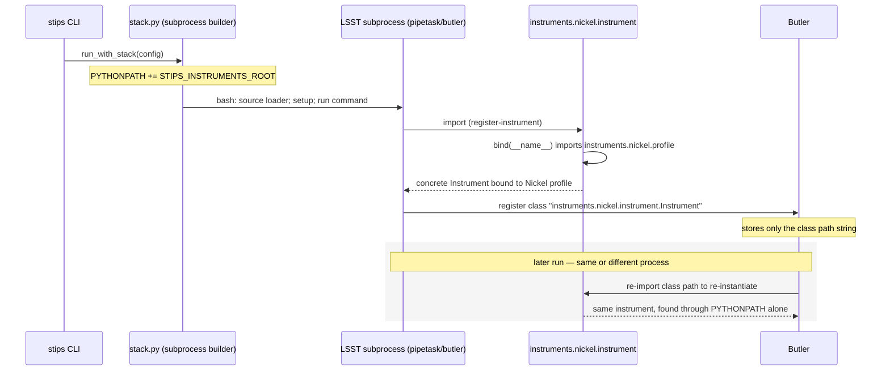
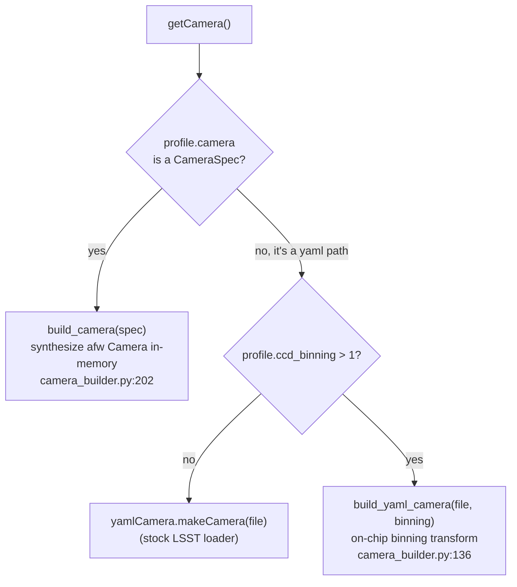
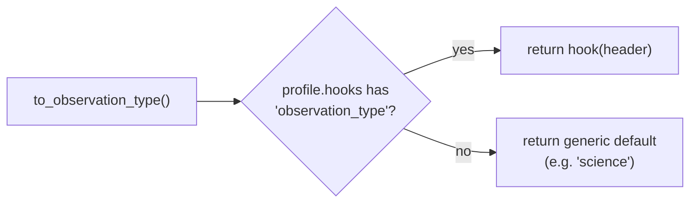
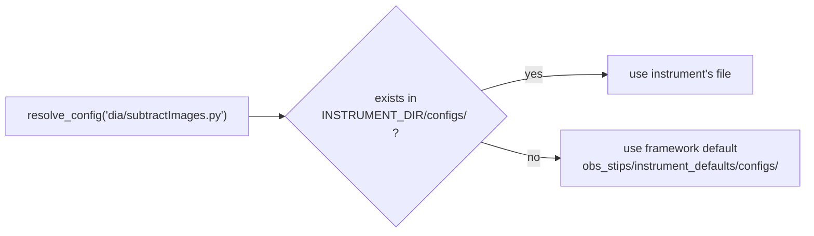
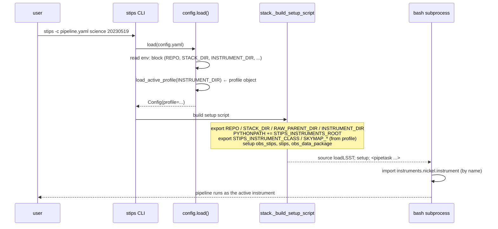
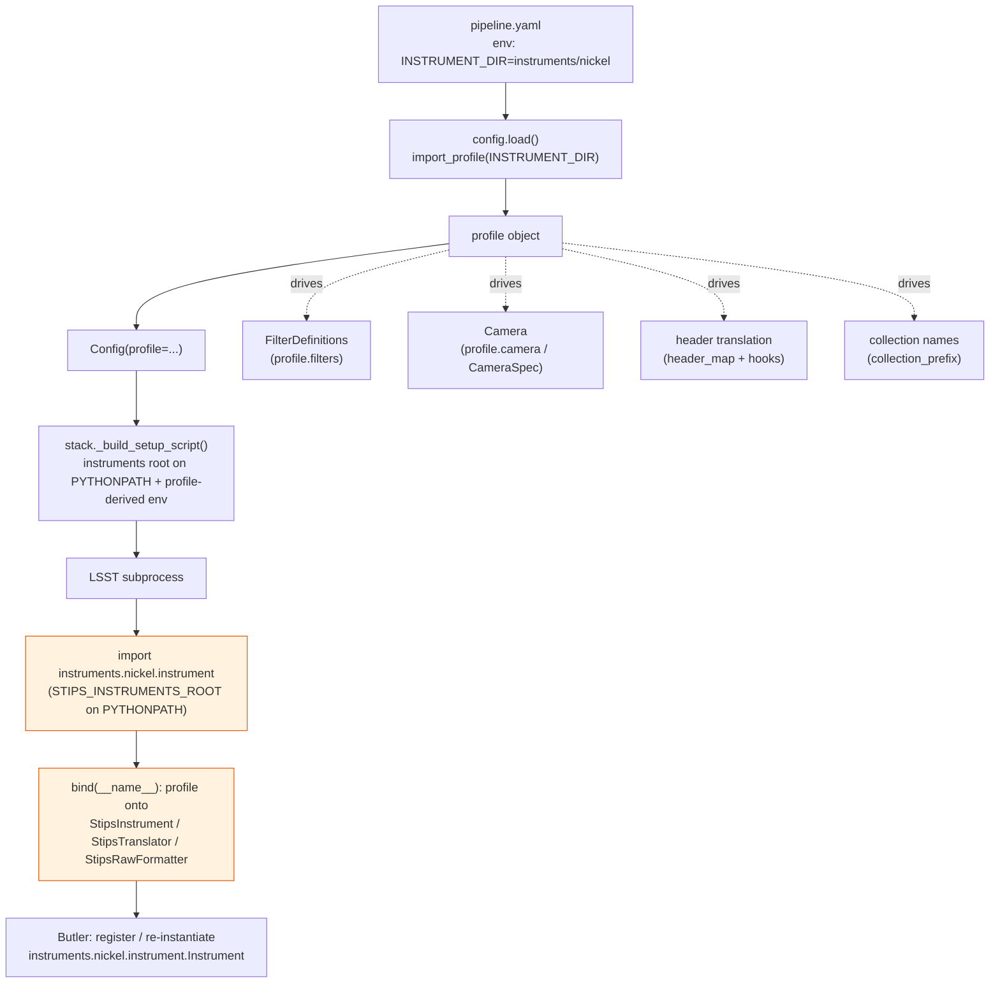

# The `obs` Abstraction: How Instrument Profiles Integrate with `obs_stips`

This document explains, in technical detail, how STIPS supports many telescopes from one
codebase: how an instrument is described, how that description is loaded, and how the generic
`obs_stips` LSST glue turns it into a concrete, Butler-registerable instrument at runtime.

> **Audience:** developers working on the framework or forking it for a new telescope.
> **Prerequisite:** familiarity with the LSST `obs_base` instrument/translator/formatter model.

---

## 1. The central idea

Telescope-specific knowledge is **never** baked into the framework code. Instead:

- The **framework** (`stips` + `obs_stips`) is written once and is fully instrument-neutral.
- Each **telescope** is a *declarative directory* — `instruments/<name>/` — whose `profile.py`
  is essentially a filled-in form (data + a few quirk callbacks).
- At runtime the framework **reads the profile and synthesizes** a concrete LSST instrument
  by binding the profile onto generic base classes.

Adding a telescope means creating a directory, not writing a package. Fixing a pipeline bug
means fixing it once in the framework; every telescope benefits.

```mermaid
flowchart TB
    subgraph FW["Framework (generic, shipped once)"]
        stips["<b>stips/</b><br/>CLI · Config · orchestration<br/>pipeline tooling"]
        obs_stips["<b>obs_stips/</b><br/>generic Instrument / Translator / Formatter<br/>default pipelines + configs"]
    end
    subgraph INST["Instruments (declarative data, one dir per telescope)"]
        nickel["<b>instruments/nickel/</b><br/>profile.py · camera/ · fetch.py"]
        ctio["<b>instruments/ctio1m/</b><br/>profile.py · camera/ · fetch.py"]
    end
    data["<b>obs_nickel_data/</b><br/>curated calibs (defects, crosstalk)"]

    stips -->|imports by name<br/>(INSTRUMENT_DIR)| nickel
    obs_stips -->|binds profile onto<br/>generic classes| nickel
    nickel -.declares.-> data

    classDef fw fill:#e3f2fd,stroke:#1565c0;
    classDef inst fill:#e8f5e9,stroke:#2e7d32;
    class stips,obs_stips fw;
    class nickel,ctio inst;
```

> **Doc drift note:** older docs/CLAUDE.md text refers to an importable `lsst.obs.nickel`
> package under `packages/obs_nickel/` selected by an `INSTRUMENT_PACKAGE` env var. That model
> was replaced by the "collapse" refactor described here: instruments are plain directories
> under `instruments/`, imported **by name** (`instruments.<name>`), with `INSTRUMENT_DIR`
> selecting the active one. There is no per-instrument installable package or EUPS product
> anymore; each dir carries only a three-line `instrument.py` nameplate.

---

## 2. The profile: one object describes the whole instrument

`InstrumentProfile` (`packages/stips/src/stips/profile.py:47`) is the single surface a forking
team edits. It is a dataclass holding everything instrument-specific as **data**, plus a small
dictionary of **hooks** for behavior that can't be expressed declaratively.



### Two filter maps pointing opposite ways

A frequent point of confusion. The two dictionaries serve different stages:

| Field | Direction | Drives |
|-------|-----------|--------|
| `filters` | `physical_filter → band` | The canonical filter registry → `FilterDefinitionCollection` |
| `filter_aliases` | raw FITS value → `physical_filter` | `to_physical_filter()` during ingest |

For Nickel (`instruments/nickel/profile.py:28`): `filters` maps `"R" → "r"`, while
`filter_aliases` maps the messy header values `"R'"`, `"RP"`, `"rp"` onto a clean
`physical_filter`. Ingest normalizes header → physical_filter → band.

### Declarative fields vs. hooks

Simple mappings are data. Everything else is a **hook** — a function registered on the profile:

```python
@hook(profile)
def observation_type(header):
    ...  # classify object/flat/bias/dark/focus from messy OBJECT/OBSTYPE
```

The `hook` decorator (`profile.py:104`) simply stores the function in `profile.hooks[name]`.
Nickel's most important hook is `tracking_radec` (`instruments/nickel/profile.py:246`), which
works around the telescope's known stale-`DEC`-header bug by cross-checking `CRVAL1/2` against
the `RA`/`DEC` keywords.

---

## 3. Loading a profile: import by name

A profile is imported as `instruments.<name>.profile` by
`stips.profile.import_profile(instrument_dir)` (stdlib only). The dir must be
`<root>/instruments/<name>/`; `<root>` is appended to `sys.path` (append, so nothing in the
tree shadows installed packages — the reason the old loader used `sys.path.append`). This is
the in-process path (the `stips` CLI itself); the stack subprocess instead gets `<root>`
**prepended** via the `PYTHONPATH` environment variable (`stack.py`'s `_build_setup_script`) —
which is harmless with respect to site-packages, since `PYTHONPATH` entries always precede
site-packages regardless of order among themselves. It is *not* harmless between roots: a
second root carrying the same instrument name (`<other_root>/instruments/<name>/`) earlier on
the path would win the import. That is why the loader checks the imported module's origin
against `instrument_dir` and fails loudly (`RuntimeError` naming both paths and the offending
`sys.path` entry) instead of silently running the wrong profile.
`instruments` is an implicit namespace package, so an out-of-tree fork merges with the in-tree
dirs. The same function serves the CLI (`Config.profile`), the in-stack refcat overlays, and
the test harness, and the stack's `binding.bind` imports the very same module name
(`instruments.<name>.profile`); there is no second loader to keep in sync.

Because the profile is a real submodule of the `instruments.<name>` package, it imports its
co-located modules relatively (`from .fetch import fetch_data`), and `<name>` must be a Python
identifier that does not start with an underscore — it becomes part of the Butler class path
(§5).

---

## 4. Synthesis: binding the profile onto generic classes

The LSST stack needs concrete `Instrument`, `MetadataTranslator`, and `RawFormatter`
*classes*. `obs_stips` ships these as **generic base classes** with an unbound `profile = None`.
Each instrument dir binds them in a three-line **nameplate**, `instruments/<name>/instrument.py`,
identical for every instrument:

```python
from lsst.obs.stips.binding import bind

Instrument, Translator, RawFormatter = bind(__name__)
```

`lsst.obs.stips.binding.bind` (`packages/obs_stips/python/lsst/obs/stips/binding.py`) imports
the sibling `instruments.<name>.profile` and builds the three subclasses with `type()`, each
with `__module__` set to `instruments.<name>.instrument`, so the classes really live at that
importable path. It also records `instrumentDir` (the directory of the profile module's file)
on the `Instrument`; `getCamera()` resolves a camera YAML against it, not against
`INSTRUMENT_DIR`.



Key design points:

- **`binding` is not imported by `obs_stips/__init__`.** Importing the package stays
  side-effect-free (and stack-light), so plotting-only code paths work without an instrument.
  Only nameplates and the legacy `active` shim (§5) import it.
- **The binding is by class attribute.** `StipsInstrument.__init_subclass__`
  (`instrument.py`) reads the bound `profile` at subclass-creation time and resolves
  `name`, `policyName`, `obsDataPackage`, and `filterDefinitions` — *without* instantiation, so
  Butler can read class-level metadata cheaply.
- **The nameplate carries no logic.** It is copied verbatim into every instrument dir; the
  identity is the directory name, everything else lives in the generic bases.

---

## 5. The Butler round trip

When Butler registers an instrument it persists the **fully-qualified class name**, which is
now unique per telescope: `instruments.<name>.instrument.Instrument` (derived from the
directory name by `stips.profile.instrument_class_for`; there is no profile field for it).

Later, Butler re-imports that class path to re-instantiate the instrument. The import needs
only `PYTHONPATH`: the directory containing `instruments/` (`STIPS_INSTRUMENTS_ROOT`, which
`stack.py` puts on `PYTHONPATH` in every stack subprocess). It never reads `INSTRUMENT_DIR`, so
**the stored class name identifies the instrument on its own**, and several instruments can
share one repo.



**Registration guard.** `stips.core.pipeline.ensure_instrument_registered` decides from the
registry what to do before a step runs, in `calibs`, `science`, `dia`, `coadd` and
`measure-crosstalk` (`stips bootstrap` always registers with `--update`; `fphot`,
`lightcurve`, `ps1-template` and `clean` skip the guard and keep working through the
`lsst.obs.stips.active` shim). Five branches:

- registered with its own class path → nothing to do;
- registered under the legacy `lsst.obs.stips.active.Instrument` (a repo from before this
  layout) → rewrites the record with `butler register-instrument --update` and logs one
  warning;
- empty repo → registers it;
- repo holds only *other* instruments → raises a `RuntimeError` naming them and pointing at
  `INSTRUMENT_DIR` (or at `stips bootstrap`, which adds an instrument to a repo on purpose);
- our instrument *name* is already registered, but under some other non-legacy class path
  (what happens after renaming an instrument dir — the old class path is still what the repo
  has stored) → raises a `RuntimeError` saying to run `stips bootstrap` to re-register it
  under the new class path.

`stips env` lists the registered instruments, marking legacy records.

**The `active` shim.** Raws ingested before this layout have datastore records naming
`lsst.obs.stips.active.RawFormatter`. `lsst.obs.stips.active` is kept as a shim for them: it
resolves `INSTRUMENT_DIR` to its nameplate and re-exports the *same* class objects, so nothing
is bound twice. New registrations never use it. See `docs/migrations.md`.

---

## 6. How the generic classes consume the profile

### 6.1 `StipsInstrument` — registration & camera

`instrument.py:28`. Generic LSST `Instrument` subclass. Highlights:

- `__init_subclass__` pulls `name`, `policyName`, `obsDataPackage`, and builds
  `filterDefinitions` — one `FilterDefinition(physical_filter, band=band)` per `profile.filters`
  entry.
- `getCamera()` branches on the `camera` field (a YAML path is resolved against the bound
  `instrumentDir`):



- `register()` writes the single-CCD geometry with stable raft/slot labels `R00`/`S00`.

### 6.2 `StipsTranslator` — header translation by profile

`translator.py:9`. Subclasses astro_metadata_translator's `FitsTranslator`.

- `__init_subclass__` (`:14`) compiles `profile.header_map` into amt's `_trivial_map` and
  `profile.const_map` into `_const_map`.
- `can_translate()` (`:23`) decides whether this translator owns a file by substring-matching
  `profile.instrument_header_value or profile.name` against the FITS `INSTRUME`. (This is how
  the profile named `"CTIO1m"` claims files whose `INSTRUME` is `"Y4KCam"`.) When the profile
  sets `binning_header` (e.g. `"CCDSUM"`), it also claims a file only if the header's binning
  matches `profile.ccd_binning`; a missing keyword reads as unbinned. That is how
  `instruments/ctio1m/` and `instruments/ctio1m_bin2/` split one camera's raws.
- Every `to_*` method follows the same **hook-first, default-fallback** pattern:



So the translator carries *no* instrument knowledge: declarative headers come from
`header_map`, and anything irregular is a profile hook. `_hook(name)` (`:33`) is just
`self.profile.hooks.get(name)`.

### 6.3 `StipsRawFormatter`

Generic raw formatter, bound to the synthesized `Instrument`/`Translator` by `binding.bind`.

---

## 7. Config & pipeline resolution: instrument-dir-first, framework fallback

A fork can override any single pipeline YAML or config `.py` by dropping a same-named file into
its own directory — without forking the shared files.

`Config.resolve_pipeline()` / `resolve_config()` (`config.py:141`–`157`):



The same instrument-dir-first logic applies to pipelines (`<dir>/pipelines/`) and the skymap
geometry config (`SKYMAP_CFG`).

---

## 8. End-to-end: from CLI command to a running pipeline

`stack.py:_build_setup_script()` assembles the bash prefix that activates the stack and
exports everything the subprocess (and Butler-inside-it) needs to import the instrument:



What `stack.py` exports and why it matters (all in `_build_setup_script`):

| Export | Source | Purpose |
|--------|--------|---------|
| `INSTRUMENT_DIR` | `config.instrument_dir` | Config overrides (`$INSTRUMENT_DIR/configs/...`) and the in-stack refcat overlays' profile import |
| `STIPS_INSTRUMENTS_ROOT` | `instruments_root(INSTRUMENT_DIR)` | Put on `PYTHONPATH`, so `instruments.<name>` imports by name |
| `STIPS_INSTRUMENT_CLASS` | `config.instrument_class` | Class path the bootstrap script registers (`register-instrument --update`) |
| `SKYMAP_NAME` / `SKYMAP_COLLECTION` | `profile.skymap_*` | Instrument-specific skymap identity |
| `SKYMAP_CFG` | `resolve_config("makeSkyMap.py")` | Instrument-dir-first skymap geometry |
| `obs_data_package` setup | `profile.obs_data_package` | `setup -r` only the active instrument's calib data |

Note there is **no** per-instrument EUPS `setup` — the instrument is purely declarative and
imported by name. Only `obs_stips`, `stips`, and the profile's data package are set up as
products. `stips` puts the configured instrument's root on `PYTHONPATH` automatically,
in-tree or not; add `<root>` yourself only for stack commands run outside `stips`, or when
a shared repo also holds an instrument from another root.

---

## 9. Putting it together — the complete map



---

## 10. Forking checklist (the abstraction in practice)

To add a telescope you touch only `instruments/<name>/`:

1. **`profile.py`** — declare `name`, `site`, `filters`, `filter_aliases`, `header_map`,
   `camera`, skymap identity, and any `@hook(profile)` quirk functions.
2. **`instrument.py`** — the nameplate, copied verbatim.
3. **`camera/`** — a single-CCD LSST `camera/<name>.yaml`, *or* set `camera=CameraSpec(...)` in
   the profile to skip the yaml entirely.
4. **`fetch.py`** (optional) — a `fetch_data(night, config, *, overwrite)` hook for archive
   downloads; wired via `profile.fetch_data` (`from .fetch import fetch_data`).
5. **`configs/` / `pipelines/`** (optional) — only the files you need to override; everything
   else falls back to `obs_stips/instrument_defaults/`.

Then point `INSTRUMENT_DIR` at the new directory. No framework code changes, no new package,
no EUPS product. See `docs/forking-stips.md` for the step-by-step walkthrough.

---

## Source map

| Concern | File |
|---------|------|
| Profile dataclass + `hook` decorator | `packages/stips/src/stips/profile.py` |
| By-name loader | `packages/stips/src/stips/profile.py` |
| Binding | `packages/obs_stips/python/lsst/obs/stips/binding.py` |
| Legacy shim | `packages/obs_stips/python/lsst/obs/stips/active.py` |
| Registration guard | `packages/stips/src/stips/core/pipeline.py` (`ensure_instrument_registered`) |
| Generic instrument | `packages/obs_stips/python/lsst/obs/stips/instrument.py` |
| Generic translator | `packages/obs_stips/python/lsst/obs/stips/translator.py` |
| Camera synthesis + binning | `packages/obs_stips/python/lsst/obs/stips/camera_builder.py` |
| Subprocess env wiring | `packages/stips/src/stips/core/stack.py` |
| Config/pipeline resolution | `packages/stips/src/stips/core/config.py:141` |
| Loader / binding tests | `packages/obs_stips/tests/test_binding.py`, `packages/stips/tests/test_profile_import.py` |
| Reference profile | `instruments/nickel/profile.py` |
