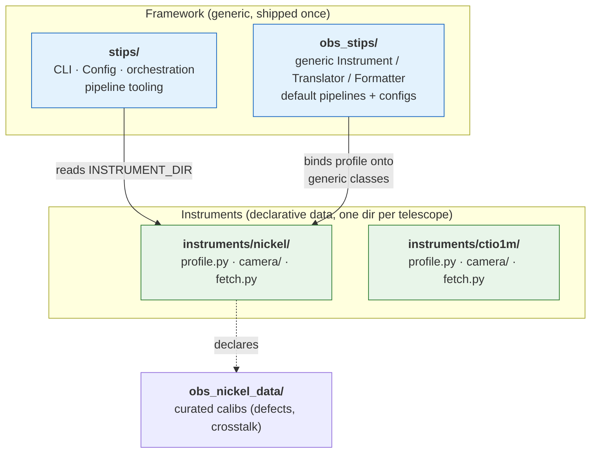
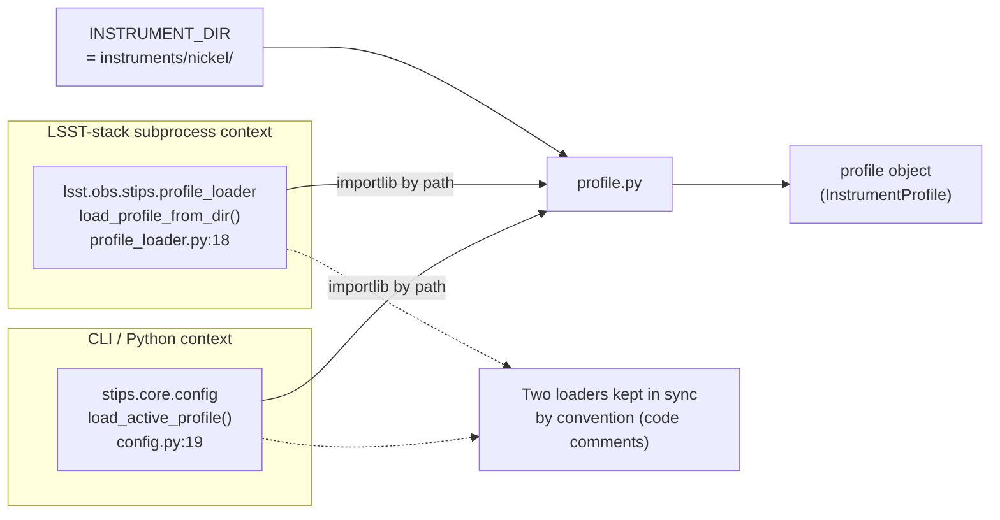
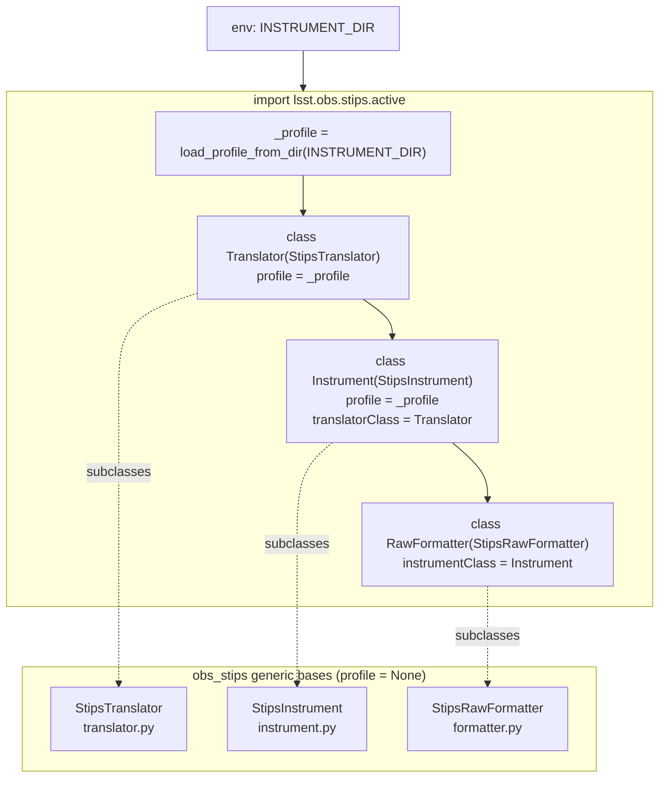
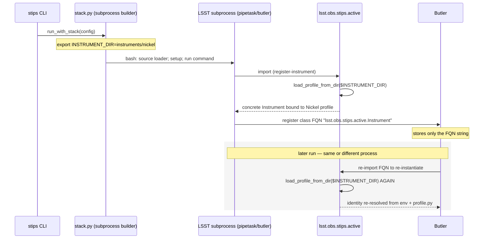
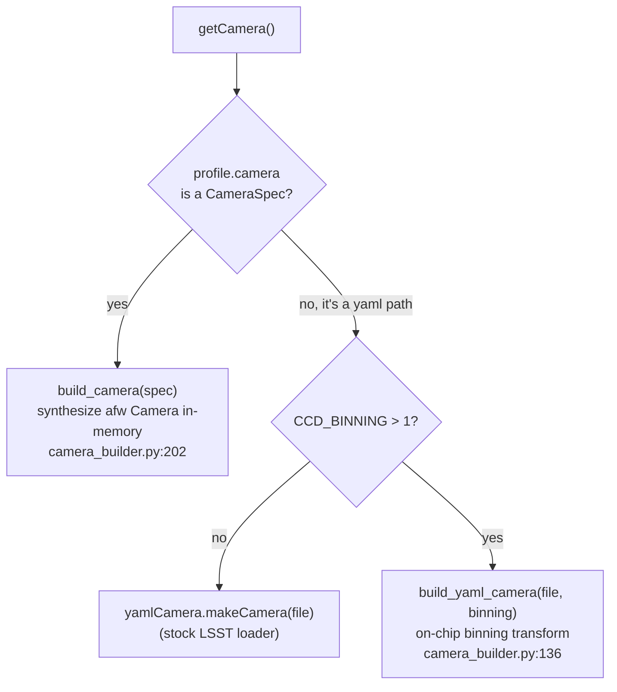
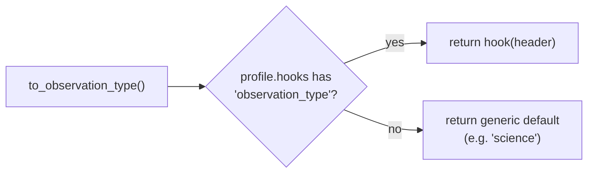
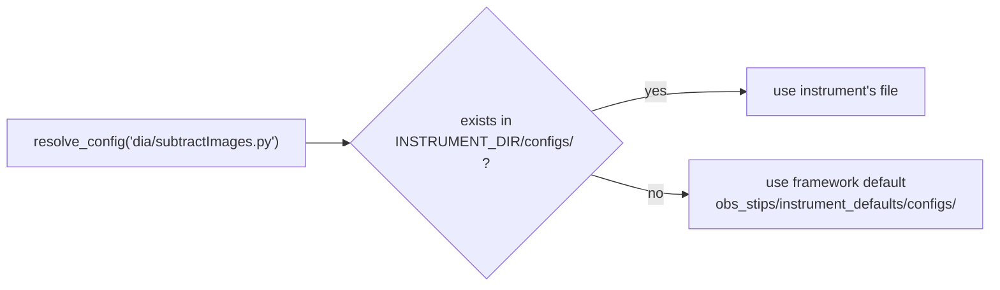
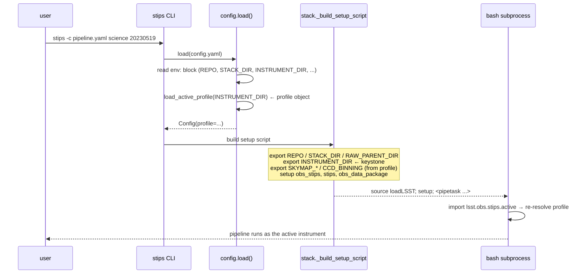
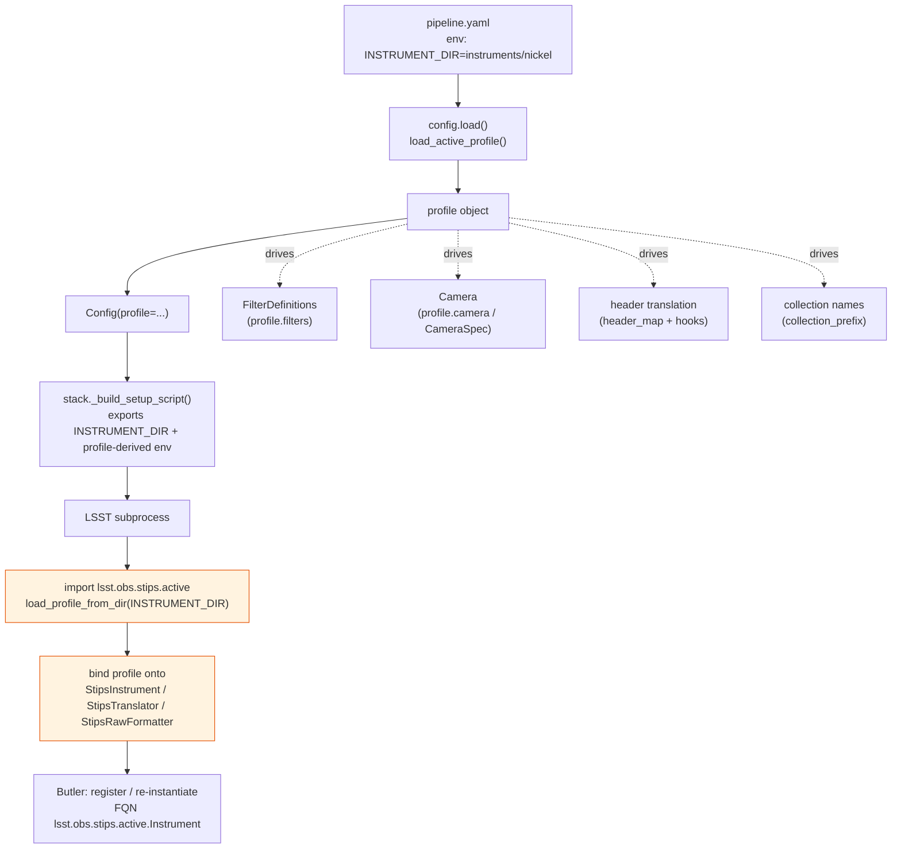

# The `obs` Abstraction: How Instrument Profiles Integrate with `obs_stips`

This document explains, in technical detail, how STIPS supports many telescopes from one
codebase: how an instrument is described, how that description is loaded, and how the generic
`obs_stips` LSST glue turns it into a concrete, Butler-registerable instrument at runtime.

> **Audience:** developers working on the framework or forking it for a new telescope.
> **Prerequisite:** familiarity with the LSST `obs_base` instrument/translator/formatter model.

---

## 1. The central idea

Telescope-specific knowledge is **never** baked into the framework code. Instead:

- The **framework** (`stips` + `obs_stips`) is written once and is fully instrument-neutral.
- Each **telescope** is a *declarative directory* — `instruments/<name>/` — whose `profile.py`
  is essentially a filled-in form (data + a few quirk callbacks).
- At runtime the framework **reads the profile and synthesizes** a concrete LSST instrument
  by binding the profile onto generic base classes.

Adding a telescope means creating a directory, not writing a package. Fixing a pipeline bug
means fixing it once in the framework; every telescope benefits.



> **Doc drift note:** older docs/CLAUDE.md text refers to an importable `lsst.obs.nickel`
> package under `packages/obs_nickel/` selected by an `INSTRUMENT_PACKAGE` env var. That model
> was replaced by the "collapse" refactor described here: instruments are plain directories
> loaded **by path** via `INSTRUMENT_DIR`. There is no per-instrument importable package or
> EUPS product anymore.

---

## 2. The profile: one object describes the whole instrument

`InstrumentProfile` (`packages/stips/src/stips/profile.py:47`) is the single surface a forking
team edits. It is a dataclass holding everything instrument-specific as **data**, plus a small
dictionary of **hooks** for behavior that can't be expressed declaratively.


### Two filter maps pointing opposite ways

A frequent point of confusion. The two dictionaries serve different stages:

| Field | Direction | Drives |
|-------|-----------|--------|
| `filters` | `physical_filter → band` | The canonical filter registry → `FilterDefinitionCollection` |
| `filter_aliases` | raw FITS value → `physical_filter` | `to_physical_filter()` during ingest |

For Nickel (`instruments/nickel/profile.py:28`): `filters` maps `"R" → "r"`, while
`filter_aliases` maps the messy header values `"R'"`, `"RP"`, `"rp"` onto a clean
`physical_filter`. Ingest normalizes header → physical_filter → band.

### Declarative fields vs. hooks

Simple mappings are data. Everything else is a **hook** — a function registered on the profile:

```python
@hook(profile)
def observation_type(header):
    ...  # classify object/flat/bias/dark/focus from messy OBJECT/OBSTYPE
```

The `hook` decorator (`profile.py:104`) simply stores the function in `profile.hooks[name]`.
Nickel's most important hook is `tracking_radec` (`instruments/nickel/profile.py:246`), which
works around the telescope's known stale-`DEC`-header bug by cross-checking `CRVAL1/2` against
the `RA`/`DEC` keywords.

---

## 3. Loading a profile: the dual by-path loader

A profile is loaded by **file path** (not by `import`), and it is loaded in **two different
runtime contexts** that don't share an interpreter — so there are two near-identical loaders
that must stay in lockstep.



**Why two loaders?**

- `stips.core.config.load_active_profile()` runs in the CLI's own Python (full `stips`
  available). It populates `Config.profile`.
- `lsst.obs.stips.profile_loader.load_profile_from_dir()` is **stdlib-only**, because it runs
  inside the bare LSST-stack environment where the `stips` package may not be importable.

Both do the same three things:

1. Resolve `<INSTRUMENT_DIR>/profile.py`.
2. **Append** the instrument dir to `sys.path` (see below).
3. `importlib`-exec the file and return its module-level `profile` object.

The two implementations are kept in sync **by convention** — each carries a code comment
pointing at the other (`config.py:27`, `profile_loader.py:5`). The stack-side loader has unit
coverage in `test_profile_loader.py` (load-by-path, `sys.path` insertion, missing-file error);
there is no automated assertion that the two bodies are byte-identical, so edit them together.

### Why `sys.path.append`, not `insert(0)`

The instrument dir holds generically-named modules (`profile.py`, `fetch.py`, `camera/`).
Prepending them to `sys.path` would let `instruments/nickel/profile.py` **shadow** any
third-party `import profile` (galsim has one). Appending makes stdlib/installed packages win,
while a uniquely-named co-located hook module like `fetch` still resolves because nothing else
provides it. This is exactly why `instruments/nickel/profile.py:9` can do
`from fetch import fetch_data`. (See the comment at `profile_loader.py:28`.)

---

## 4. Synthesis: binding the profile onto generic classes

The LSST stack needs concrete `Instrument`, `MetadataTranslator`, and `RawFormatter`
*classes*. `obs_stips` ships these as **generic base classes** with an unbound `profile = None`.
The module `lsst.obs.stips.active` (`packages/obs_stips/python/lsst/obs/stips/active.py`) does
the binding at **import time**:

```python
# active.py (abbreviated)
_profile = load_profile_from_dir(os.environ["INSTRUMENT_DIR"])   # fail-loud if unset

class Translator(StipsTranslator):   profile = _profile
class Instrument(StipsInstrument):   profile = _profile; translatorClass = Translator
class RawFormatter(StipsRawFormatter):
    instrumentClass = Instrument
    translatorClass = Translator
    filterDefinitions = Instrument.filterDefinitions
```



Key design points:

- **`active` is not imported by `obs_stips/__init__`.** Importing the package stays
  side-effect-free, so plotting-only code paths work even with `INSTRUMENT_DIR` unset.
  Importing `active` *itself* requires the env var and fails loud otherwise (`active.py:22`).
- **The binding is by class attribute.** `StipsInstrument.__init_subclass__`
  (`instrument.py:37`) reads the bound `profile` at subclass-creation time and resolves
  `name`, `policyName`, `obsDataPackage`, and `filterDefinitions` — *without* instantiation, so
  Butler can read class-level metadata cheaply.

---

## 5. The Butler round trip: why `INSTRUMENT_DIR` must follow the subprocess

Here's the subtlety that ties it all together. When Butler registers an instrument it persists
the **fully-qualified class name**, which for *every* STIPS telescope is the same string:
`lsst.obs.stips.active.Instrument` (set via `profile.instrument_class`,
`instruments/nickel/profile.py:71`).

Later, Butler re-imports that FQN to re-instantiate the instrument. Re-importing `active`
re-runs `load_profile_from_dir(os.environ["INSTRUMENT_DIR"])` — so **the identity of the
instrument is carried by the env var + profile file, not by the persisted class name.**



Practical consequence: **every** LSST subprocess must have `INSTRUMENT_DIR` exported.
`stack.py:_build_setup_script()` (`packages/stips/src/stips/core/stack.py:37`) does this — see
§7.

---

## 6. How the generic classes consume the profile

### 6.1 `StipsInstrument` — registration & camera

`instrument.py:28`. Generic LSST `Instrument` subclass. Highlights:

- `__init_subclass__` (`:37`) pulls `name`, `policyName`, `obsDataPackage`, and builds
  `filterDefinitions` — one `FilterDefinition(physical_filter, band=band)` per `profile.filters`
  entry (`:49`).
- `getCamera()` (`:63`) branches on the `camera` field:



- `register()` (`:88`) writes the single-CCD geometry with stable raft/slot labels `R00`/`S00`.

### 6.2 `StipsTranslator` — header translation by profile

`translator.py:9`. Subclasses astro_metadata_translator's `FitsTranslator`.

- `__init_subclass__` (`:14`) compiles `profile.header_map` into amt's `_trivial_map` and
  `profile.const_map` into `_const_map`.
- `can_translate()` (`:23`) decides whether this translator owns a file by substring-matching
  `profile.instrument_header_value or profile.name` against the FITS `INSTRUME`. (This is how
  the profile named `"CTIO1m"` claims files whose `INSTRUME` is `"Y4KCam"`.)
- Every `to_*` method follows the same **hook-first, default-fallback** pattern:



So the translator carries *no* instrument knowledge: declarative headers come from
`header_map`, and anything irregular is a profile hook. `_hook(name)` (`:33`) is just
`self.profile.hooks.get(name)`.

### 6.3 `StipsRawFormatter`

Generic raw formatter, bound to the synthesized `Instrument`/`Translator` in `active.py:45`.

---

## 7. Config & pipeline resolution: instrument-dir-first, framework fallback

A fork can override any single pipeline YAML or config `.py` by dropping a same-named file into
its own directory — without forking the shared files.

`Config.resolve_pipeline()` / `resolve_config()` (`config.py:141`–`157`):



The same instrument-dir-first logic applies to pipelines (`<dir>/pipelines/`) and the skymap
geometry config (`SKYMAP_CFG`).

---

## 8. End-to-end: from CLI command to a running pipeline

`stack.py:_build_setup_script()` (`:37`) assembles the bash prefix that activates the stack and
exports everything the subprocess (and Butler-inside-it) needs to re-resolve the profile:



What `stack.py` exports and why it matters (all in `_build_setup_script`):

| Export | Source | Purpose |
|--------|--------|---------|
| `INSTRUMENT_DIR` | `config.instrument_dir` (`:67`) | **Keystone** — lets `active` re-resolve the profile in-subprocess |
| `SKYMAP_NAME` / `SKYMAP_COLLECTION` | `profile.skymap_*` (`:84`) | Instrument-specific skymap identity |
| `SKYMAP_CFG` | `resolve_config("makeSkyMap.py")` (`:95`) | Instrument-dir-first skymap geometry |
| `CCD_BINNING` | config `env:` block (`:77`) | On-chip binning camera transform |
| `obs_data_package` setup | `profile.obs_data_package` (`:106`) | `setup -r` only the active instrument's calib data |

Note there is **no** per-instrument EUPS `setup` — the instrument is purely declarative. Only
`obs_stips`, `stips`, and the profile's data package are set up as products.

---

## 9. Putting it together — the complete map



---

## 10. Forking checklist (the abstraction in practice)

To add a telescope you touch only `instruments/<name>/`:

1. **`profile.py`** — declare `name`, `site`, `filters`, `filter_aliases`, `header_map`,
   `camera`, `instrument_class="lsst.obs.stips.active.Instrument"`, skymap identity, and any
   `@hook(profile)` quirk functions.
2. **`camera/`** — a single-CCD LSST `camera/<name>.yaml`, *or* set `camera=CameraSpec(...)` in
   the profile to skip the yaml entirely.
3. **`fetch.py`** (optional) — a `fetch_data(night, config, *, overwrite)` hook for archive
   downloads; wired via `profile.fetch_data`.
4. **`configs/` / `pipelines/`** (optional) — only the files you need to override; everything
   else falls back to `obs_stips/instrument_defaults/`.

Then point `INSTRUMENT_DIR` at the new directory. No framework code changes, no new package,
no EUPS product. See `docs/forking-stips.md` for the step-by-step walkthrough.

---

## Source map

| Concern | File |
|---------|------|
| Profile dataclass + `hook` decorator | `packages/stips/src/stips/profile.py` |
| CLI-side by-path loader | `packages/stips/src/stips/core/config.py:19` |
| Stack-side by-path loader | `packages/obs_stips/python/lsst/obs/stips/profile_loader.py` |
| Import-time synthesis | `packages/obs_stips/python/lsst/obs/stips/active.py` |
| Generic instrument | `packages/obs_stips/python/lsst/obs/stips/instrument.py` |
| Generic translator | `packages/obs_stips/python/lsst/obs/stips/translator.py` |
| Camera synthesis + binning | `packages/obs_stips/python/lsst/obs/stips/camera_builder.py` |
| Subprocess env wiring | `packages/stips/src/stips/core/stack.py:37` |
| Config/pipeline resolution | `packages/stips/src/stips/core/config.py:141` |
| Stack-side loader tests | `packages/obs_stips/tests/test_profile_loader.py` |
| Reference profile | `instruments/nickel/profile.py` |
